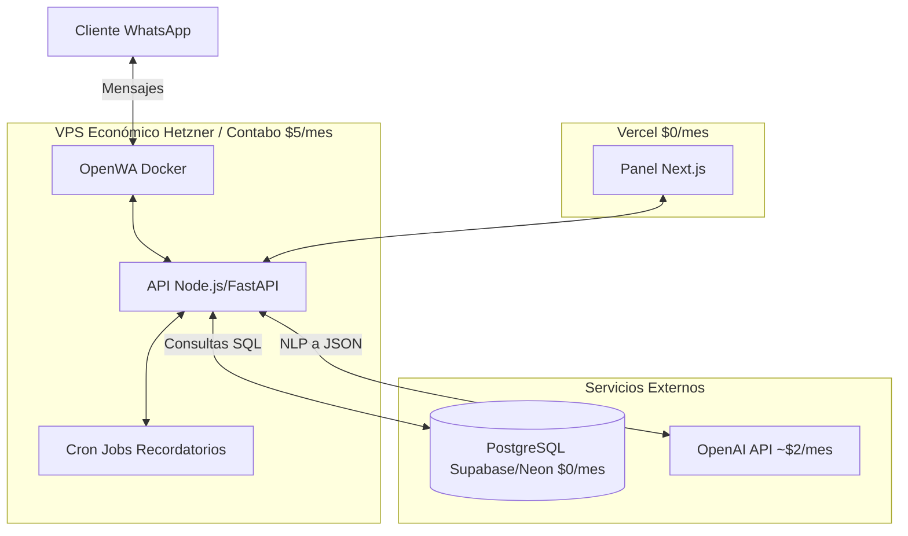

# Plan de Arquitectura y Despliegue: Bot de WhatsApp para Barbería

Este documento detalla las recomendaciones para la arquitectura y el despliegue del sistema de gestión de citas con OpenWA, buscando optimizar los costos y mantener un rendimiento empresarial.

## 1. Análisis de Restricciones y Despliegue

La principal restricción tecnológica de este proyecto es **OpenWA**. OpenWA requiere mantener una sesión persistente con WhatsApp (usualmente a través de Puppeteer/Chromium o una conexión web socket continua), lo que significa que **no puede ejecutarse en entornos Serverless (sin servidor) como Vercel o AWS Lambda** para el proceso principal del bot.

Vercel está diseñado para funciones efímeras (que mueren después de unos segundos), por lo que si intentas alojar OpenWA allí, la sesión se cerrará constantemente y el bot dejará de funcionar.

### Recomendación de Infraestructura (Costo Optimizado)

Para mantener los costos al mínimo (menos de $10 USD al mes) aprovechando servicios gratuitos, te recomiendo esta arquitectura dividida:

#### A. Frontend (Panel Administrativo) -> Vercel (Costo: $0)
*   **Tecnología:** Next.js + React.
*   **Hosting:** Vercel (Plan Hobby gratuito).
*   **Justificación:** Vercel es ideal para el panel web, ofrece despliegue continuo desde GitHub y rendimiento global gratuito.

#### B. Base de Datos -> Supabase o Neon (Costo: $0)
*   **Tecnología:** PostgreSQL.
*   **Hosting:** Supabase o Neon.tech (Planes gratuitos).
*   **Justificación:** Ambos ofrecen bases de datos PostgreSQL en la nube con capacidades suficientes para una barbería en sus capas gratuitas. Supabase además te daría autenticación fácil para tu panel de Next.js.

#### C. Backend (API + OpenWA) -> VPS Económico (Costo: $4 - $6 / mes)
*   **Tecnología:** Node.js/Express o Python/FastAPI + OpenWA (corriendo en Docker).
*   **Hosting:** 
    *   **Hetzner:** (VPS ARM64 o x86 básico) ~ €3.79 a €4.50 / mes. (Excelente rendimiento por el precio).
    *   **Contabo:** VPS básico ~ $5.50 / mes (Mucha RAM, ideal si OpenWA consume recursos con Chromium).
    *   **Railway/Render:** (Alternativas PaaS) ~ $5 - $10 / mes. Más fáciles de configurar que un VPS puro, pero un poco más costosos.
*   **Justificación:** Necesitas un servidor que esté encendido 24/7. Un VPS de Hetzner o Contabo te da control total para correr el `docker-compose.dev.yml` de OpenWA junto con tu API de forma económica.

#### D. Inteligencia Artificial -> OpenAI API (Costo: Variable, < $5 / mes)
*   **Tecnología:** GPT-4o-mini o GPT-3.5-turbo.
*   **Costo:** Pago por uso. Para una barbería pequeña, procesar intenciones (conversión de texto a JSON) con modelos rápidos y baratos como `gpt-4o-mini` costará céntimos al día.

#### E. Tareas Programadas (Recordatorios)
*   **Opción 1:** Cron jobs en el VPS (usando `node-cron` o similar en tu backend). Costo: $0.
*   **Opción 2:** Vercel Cron Jobs llamando a tu API en el VPS. Costo: $0.

---

## 2. Arquitectura de Software Recomendada

Dado el contexto de bajo costo, la arquitectura más eficiente es consolidar el Backend y OpenWA en el VPS.

### Flujo de Interacción
1.  El cliente escribe por WhatsApp.
2.  OpenWA (en el VPS) recibe el mensaje y lo envía vía Webhook o llamada interna a tu API (también en el VPS).
3.  Tu API envía el texto a OpenAI solicitando que extraiga la intención y datos (ej. `{"intent": "crear_cita", "fecha": "2024-05-20"}`).
4.  La API recibe el JSON de OpenAI, consulta la Base de Datos (Supabase) para ver disponibilidad.
5.  La API construye la respuesta y le dice a OpenWA que envíe el mensaje al cliente.

---

## 3. Siguientes Pasos (Roadmap del MVP)

Si estás de acuerdo con este enfoque, el plan de acción sería:

1.  **Diseño de la Base de Datos:** Definir el esquema de Prisma para PostgreSQL (Clientes, Citas, Servicios, Horarios).
2.  **Desarrollo del Backend Core:** Crear la API que gestiona la lógica (crear cita, verificar disponibilidad).
3.  **Integración de IA:** Crear el "Router de Intenciones" que conecta con OpenAI para entender el lenguaje natural.
4.  **Integración OpenWA:** Levantar el contenedor de OpenWA y conectarlo mediante webhooks a nuestro backend.
5.  **Desarrollo del Panel (Frontend):** Construir la interfaz en Next.js para que el dueño de la barbería administre el negocio.
6.  **Despliegue:** Configurar Supabase, subir el Frontend a Vercel, y configurar el VPS con Docker para OpenWA y el Backend.

¿Deseas que comencemos definiendo el modelo de base de datos (Prisma schema) y la estructura del proyecto backend?
